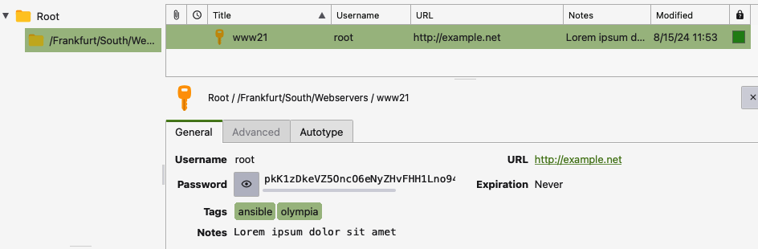

# Ansible Collection - ansilab.keepass

Related to KeePassXC et.al.

```yaml
- hosts: localhost
  connection: local
  collections:
    - ansilab.keepass
  vars:
    kdb: nn0.kdbx
    psw: "NN0"
    key: "nn0.keyx"

  tasks:
  - name: Create key file
    command:
        cmd: genkeyx -o "{{ key }}"         # https://github.com/jpmens/genkeyx
        creates: "{{ key }}"

  - name: Open (or create) KDBX and add an entry for www21
    ansilab.keepass.keepassxc_add_entry:
        database: "{{ kdb }}"
        create: true
        password: "{{ psw }}"
        keyfile: "{{ key }}"
        entrypath: "/Frankfurt/South/Webservers"
        title: "www21"
        user: "root"
        # secret: "bla"         # generated if not specified
        tags: [ ansible, olympia ]
        url: http://example.net
        notes: >-
           Lorem ipsum dolor sit amet
        state: present
```



